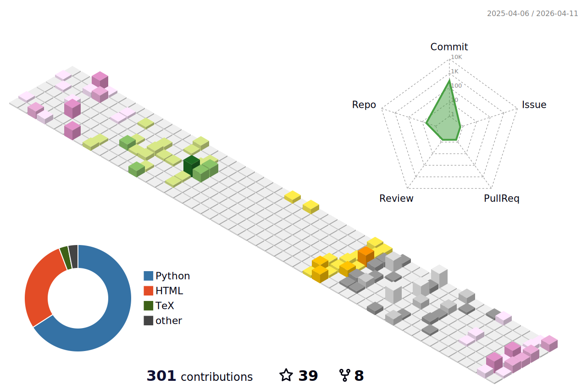

### 🧰 Technologies & Tools


<!-- -->


<!--START_SECTION:waka-->


**🐱 My GitHub Data** 

> 📦 1.5 MB Used in GitHub's Storage 
 > 
> 🏆 210 Contributions in the Year 2025
 > 
> 🚫 Not Opted to Hire
 > 
> 📜 14 Public Repositories 
 > 
> 🔑 14 Private Repositories 
 > 
**I'm a Night 🦉** 

```text
🌞 Morning                403 commits         ██░░░░░░░░░░░░░░░░░░░░░░░   09.83 % 
🌆 Daytime                1532 commits        █████████░░░░░░░░░░░░░░░░   37.37 % 
🌃 Evening                1557 commits        █████████░░░░░░░░░░░░░░░░   37.98 % 
🌙 Night                  608 commits         ████░░░░░░░░░░░░░░░░░░░░░   14.83 % 
```
📅 **I'm Most Productive on Thursday** 

```text
Monday                   647 commits         ████░░░░░░░░░░░░░░░░░░░░░   15.78 % 
Tuesday                  594 commits         ████░░░░░░░░░░░░░░░░░░░░░   14.49 % 
Wednesday                620 commits         ████░░░░░░░░░░░░░░░░░░░░░   15.12 % 
Thursday                 718 commits         ████░░░░░░░░░░░░░░░░░░░░░   17.51 % 
Friday                   582 commits         ████░░░░░░░░░░░░░░░░░░░░░   14.20 % 
Saturday                 430 commits         ███░░░░░░░░░░░░░░░░░░░░░░   10.49 % 
Sunday                   509 commits         ███░░░░░░░░░░░░░░░░░░░░░░   12.41 % 
```


📊 **This Week I Spent My Time On** 

```text
🕑︎ Time Zone: Asia/Shanghai

💬 Programming Languages: 
No Activity Tracked This Week

🔥 Editors: 
No Activity Tracked This Week

💻 Operating System: 
No Activity Tracked This Week
```

**I Mostly Code in Python** 

```text
Python                   19 repos            ██████████████░░░░░░░░░░░   57.58 % 
TeX                      4 repos             ███░░░░░░░░░░░░░░░░░░░░░░   12.12 % 
Jupyter Notebook         4 repos             ███░░░░░░░░░░░░░░░░░░░░░░   12.12 % 
HTML                     2 repos             ██░░░░░░░░░░░░░░░░░░░░░░░   06.06 % 
Java                     1 repo              █░░░░░░░░░░░░░░░░░░░░░░░░   03.03 % 
```


 Last Updated on 10/10/2025 18:46:25 UTC
<!--END_SECTION:waka-->
