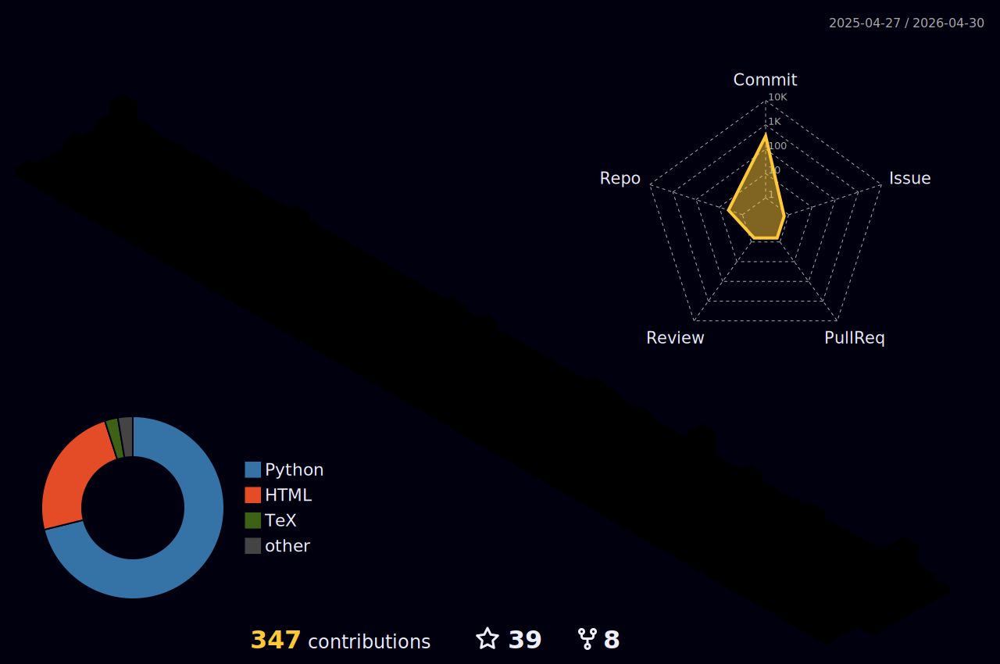

<!-- -->

<!--START_SECTION:waka-->


**🐱 My GitHub Data** 

> 📦 1.2 MB Used in GitHub's Storage 
 > 
> 🚫 Not Opted to Hire
 > 
> 📜 15 Public Repositories 
 > 
> 🔑 14 Private Repositories 
 > 
**I'm a Night 🦉** 

```text
🌞 Morning                470 commits         ██░░░░░░░░░░░░░░░░░░░░░░░   09.33 % 
🌆 Daytime                1869 commits        █████████░░░░░░░░░░░░░░░░   37.08 % 
🌃 Evening                1920 commits        ██████████░░░░░░░░░░░░░░░   38.10 % 
🌙 Night                  781 commits         ████░░░░░░░░░░░░░░░░░░░░░   15.50 % 
```
📅 **I'm Most Productive on Thursday** 

```text
Monday                   820 commits         ████░░░░░░░░░░░░░░░░░░░░░   16.27 % 
Tuesday                  757 commits         ████░░░░░░░░░░░░░░░░░░░░░   15.02 % 
Wednesday                712 commits         ████░░░░░░░░░░░░░░░░░░░░░   14.13 % 
Thursday                 880 commits         ████░░░░░░░░░░░░░░░░░░░░░   17.46 % 
Friday                   707 commits         ████░░░░░░░░░░░░░░░░░░░░░   14.03 % 
Saturday                 531 commits         ███░░░░░░░░░░░░░░░░░░░░░░   10.54 % 
Sunday                   633 commits         ███░░░░░░░░░░░░░░░░░░░░░░   12.56 % 
```


📊 **This Week I Spent My Time On** 

```text
🕑︎ Time Zone: Asia/Shanghai

💬 Programming Languages: 
Other                    2 mins              █████████████████████████   100.00 % 

🔥 Editors: 
VS Code                  2 mins              █████████████████████████   100.00 % 

💻 Operating System: 
Mac                      2 mins              █████████████████████████   100.00 % 
```

**I Mostly Code in Python** 

```text
Python                   17 repos            ████████████░░░░░░░░░░░░░   48.57 % 
Jupyter Notebook         4 repos             ███░░░░░░░░░░░░░░░░░░░░░░   11.43 % 
HTML                     4 repos             ███░░░░░░░░░░░░░░░░░░░░░░   11.43 % 
TeX                      3 repos             ██░░░░░░░░░░░░░░░░░░░░░░░   08.57 % 
Vue                      2 repos             █░░░░░░░░░░░░░░░░░░░░░░░░   05.71 % 
```


 Last Updated on 05/02/2025 18:43:25 UTC
<!--END_SECTION:waka-->
