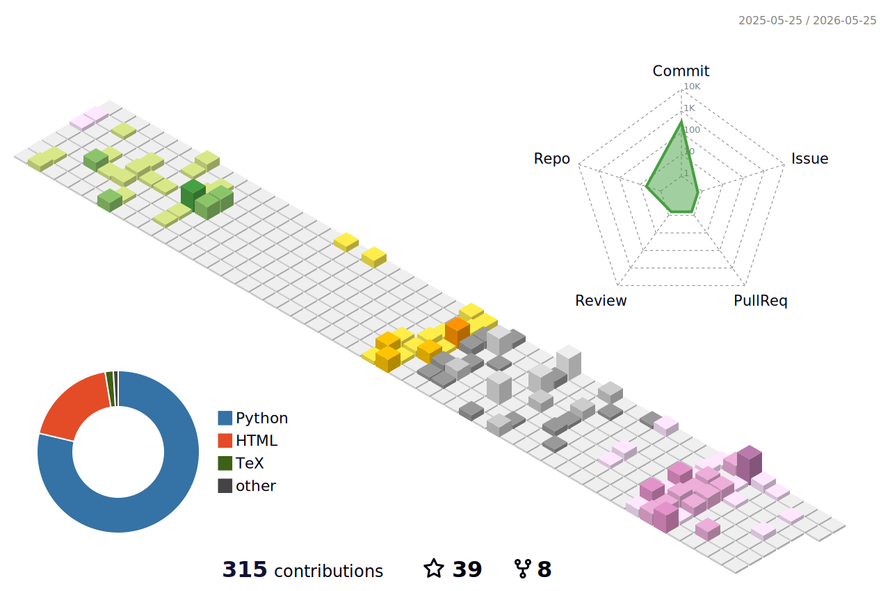

### 🧰 Technologies & Tools


<!-- -->


<!--START_SECTION:waka-->


**🐱 My GitHub Data** 

> 📦 1.5 MB Used in GitHub's Storage 
 > 
> 🏆 147 Contributions in the Year 2026
 > 
> 🚫 Not Opted to Hire
 > 
> 📜 14 Public Repositories 
 > 
> 🔑 17 Private Repositories 
 > 
**I'm a Night 🦉** 

```text
🌞 Morning                454 commits         ██░░░░░░░░░░░░░░░░░░░░░░░   09.50 % 
🌆 Daytime                1764 commits        █████████░░░░░░░░░░░░░░░░   36.90 % 
🌃 Evening                1812 commits        █████████░░░░░░░░░░░░░░░░   37.91 % 
🌙 Night                  750 commits         ████░░░░░░░░░░░░░░░░░░░░░   15.69 % 
```
📅 **I'm Most Productive on Thursday** 

```text
Monday                   742 commits         ████░░░░░░░░░░░░░░░░░░░░░   15.52 % 
Tuesday                  695 commits         ████░░░░░░░░░░░░░░░░░░░░░   14.54 % 
Wednesday                727 commits         ████░░░░░░░░░░░░░░░░░░░░░   15.21 % 
Thursday                 827 commits         ████░░░░░░░░░░░░░░░░░░░░░   17.30 % 
Friday                   664 commits         ███░░░░░░░░░░░░░░░░░░░░░░   13.89 % 
Saturday                 521 commits         ███░░░░░░░░░░░░░░░░░░░░░░   10.90 % 
Sunday                   604 commits         ███░░░░░░░░░░░░░░░░░░░░░░   12.64 % 
```


📊 **This Week I Spent My Time On** 

```text
🕑︎ Time Zone: Asia/Shanghai

💬 Programming Languages: 
No Activity Tracked This Week

🔥 Editors: 
No Activity Tracked This Week

💻 Operating System: 
No Activity Tracked This Week
```

**I Mostly Code in Python** 

```text
Python                   20 repos            ██████████████░░░░░░░░░░░   57.14 % 
Jupyter Notebook         5 repos             ████░░░░░░░░░░░░░░░░░░░░░   14.29 % 
TeX                      4 repos             ███░░░░░░░░░░░░░░░░░░░░░░   11.43 % 
HTML                     2 repos             █░░░░░░░░░░░░░░░░░░░░░░░░   05.71 % 
Java                     1 repo              █░░░░░░░░░░░░░░░░░░░░░░░░   02.86 % 
```


 Last Updated on 14/04/2026 19:49:03 UTC
<!--END_SECTION:waka-->
