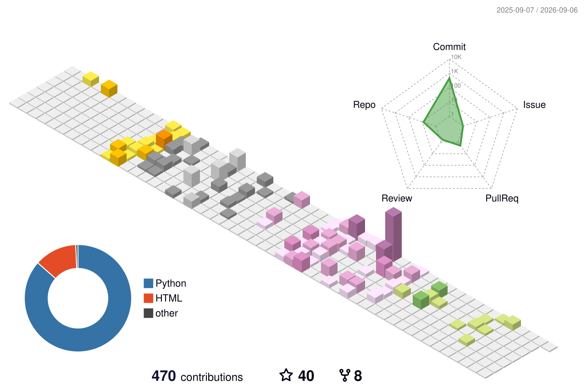

### 🧰 Technologies & Tools


<!-- -->


<!--START_SECTION:waka-->


**🐱 My GitHub Data** 

> 📦 1.6 MB Used in GitHub's Storage 
 > 
> 🏆 361 Contributions in the Year 2026
 > 
> 🚫 Not Opted to Hire
 > 
> 📜 16 Public Repositories 
 > 
> 🔑 20 Private Repositories 
 > 
**I'm a Night 🦉** 

```text
🌞 Morning                506 commits         ██░░░░░░░░░░░░░░░░░░░░░░░   08.66 % 
🌆 Daytime                2149 commits        █████████░░░░░░░░░░░░░░░░   36.80 % 
🌃 Evening                2227 commits        ██████████░░░░░░░░░░░░░░░   38.13 % 
🌙 Night                  958 commits         ████░░░░░░░░░░░░░░░░░░░░░   16.40 % 
```
📅 **I'm Most Productive on Thursday** 

```text
Monday                   898 commits         ████░░░░░░░░░░░░░░░░░░░░░   15.38 % 
Tuesday                  830 commits         ████░░░░░░░░░░░░░░░░░░░░░   14.21 % 
Wednesday                935 commits         ████░░░░░░░░░░░░░░░░░░░░░   16.01 % 
Thursday                 936 commits         ████░░░░░░░░░░░░░░░░░░░░░   16.03 % 
Friday                   768 commits         ███░░░░░░░░░░░░░░░░░░░░░░   13.15 % 
Saturday                 644 commits         ███░░░░░░░░░░░░░░░░░░░░░░   11.03 % 
Sunday                   829 commits         ████░░░░░░░░░░░░░░░░░░░░░   14.20 % 
```


📊 **This Week I Spent My Time On** 

```text
🕑︎ Time Zone: Asia/Shanghai

💬 Programming Languages: 
No Activity Tracked This Week

🔥 Editors: 
No Activity Tracked This Week

💻 Operating System: 
No Activity Tracked This Week
```

🤖 **AI Coding This Week** 

```text
No AI Coding Activity Tracked This Week
```

**I Mostly Code in Python** 

```text
Python                   25 repos            ████████████████░░░░░░░░░   62.50 % 
Jupyter Notebook         5 repos             ███░░░░░░░░░░░░░░░░░░░░░░   12.50 % 
TeX                      4 repos             ██░░░░░░░░░░░░░░░░░░░░░░░   10.00 % 
HTML                     2 repos             █░░░░░░░░░░░░░░░░░░░░░░░░   05.00 % 
Java                     1 repo              █░░░░░░░░░░░░░░░░░░░░░░░░   02.50 % 
```


 Last Updated on 07/08/2026 00:24:27 UTC
<!--END_SECTION:waka-->
