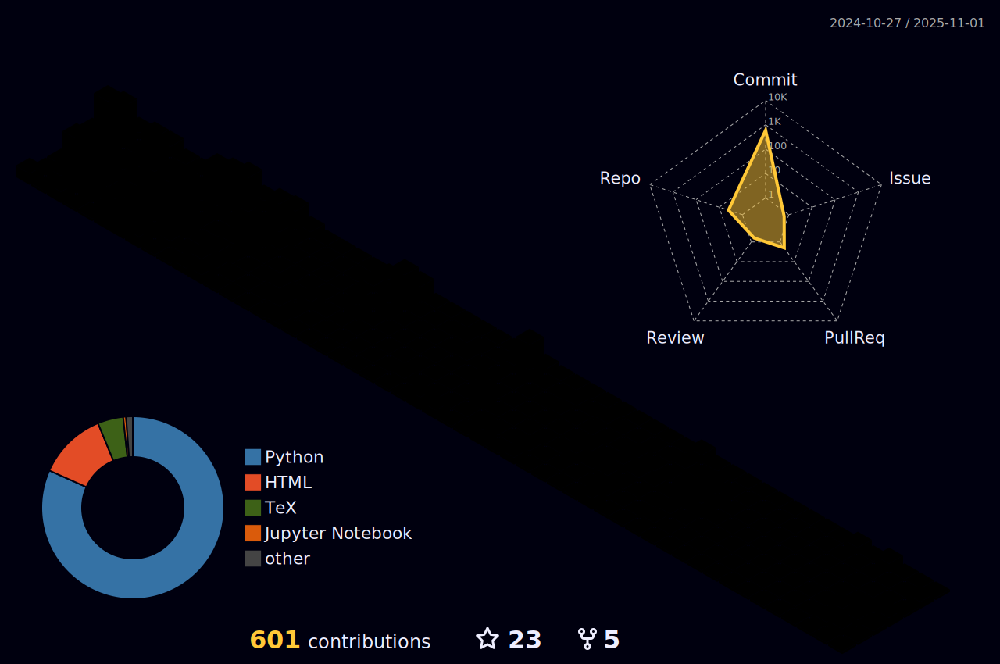

<!-- -->

<!--START_SECTION:waka-->


**🐱 My GitHub Data** 

> 📦 963.4 kB Used in GitHub's Storage 
 > 
> 🚫 Not Opted to Hire
 > 
> 📜 15 Public Repositories 
 > 
> 🔑 13 Private Repositories 
 > 
**I'm a Night 🦉** 

```text
🌞 Morning                337 commits         ███░░░░░░░░░░░░░░░░░░░░░░   10.38 % 
🌆 Daytime                1216 commits        █████████░░░░░░░░░░░░░░░░   37.46 % 
🌃 Evening                1222 commits        █████████░░░░░░░░░░░░░░░░   37.65 % 
🌙 Night                  471 commits         ████░░░░░░░░░░░░░░░░░░░░░   14.51 % 
```
📅 **I'm Most Productive on Monday** 

```text
Monday                   549 commits         ████░░░░░░░░░░░░░░░░░░░░░   16.91 % 
Tuesday                  546 commits         ████░░░░░░░░░░░░░░░░░░░░░   16.82 % 
Wednesday                408 commits         ███░░░░░░░░░░░░░░░░░░░░░░   12.57 % 
Thursday                 547 commits         ████░░░░░░░░░░░░░░░░░░░░░   16.85 % 
Friday                   470 commits         ████░░░░░░░░░░░░░░░░░░░░░   14.48 % 
Saturday                 325 commits         ███░░░░░░░░░░░░░░░░░░░░░░   10.01 % 
Sunday                   401 commits         ███░░░░░░░░░░░░░░░░░░░░░░   12.35 % 
```


📊 **This Week I Spent My Time On** 

```text
🕑︎ Time Zone: Asia/Shanghai

💬 Programming Languages: 
Python                   17 hrs 47 mins      █████████████████████░░░░   83.19 % 
Bash                     2 hrs 1 min         ██░░░░░░░░░░░░░░░░░░░░░░░   09.48 % 
JSON                     43 mins             █░░░░░░░░░░░░░░░░░░░░░░░░   03.40 % 
YAML                     25 mins             ░░░░░░░░░░░░░░░░░░░░░░░░░   01.98 % 
Other                    23 mins             ░░░░░░░░░░░░░░░░░░░░░░░░░   01.82 % 

🔥 Editors: 
Cursor                   21 hrs 22 mins      █████████████████████████   100.00 % 

💻 Operating System: 
Linux                    21 hrs 22 mins      █████████████████████████   100.00 % 
```

**I Mostly Code in Python** 

```text
Python                   15 repos            ████████████░░░░░░░░░░░░░   46.88 % 
HTML                     4 repos             ███░░░░░░░░░░░░░░░░░░░░░░   12.50 % 
Jupyter Notebook         3 repos             ██░░░░░░░░░░░░░░░░░░░░░░░   09.38 % 
TeX                      3 repos             ██░░░░░░░░░░░░░░░░░░░░░░░   09.38 % 
Vue                      2 repos             ██░░░░░░░░░░░░░░░░░░░░░░░   06.25 % 
```


 Last Updated on 08/10/2024 18:42:22 UTC
<!--END_SECTION:waka-->
