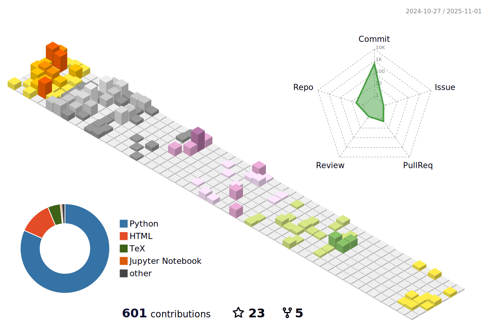

### 🧰 Technologies & Tools


<!-- -->


<!--START_SECTION:waka-->


**🐱 My GitHub Data** 

> 📦 1.5 MB Used in GitHub's Storage 
 > 
> 🏆 49 Contributions in the Year 2026
 > 
> 🚫 Not Opted to Hire
 > 
> 📜 14 Public Repositories 
 > 
> 🔑 17 Private Repositories 
 > 
**I Mostly Code in Python** 

```text
Python                   20 repos            ██████████████░░░░░░░░░░░   57.14 % 
Jupyter Notebook         5 repos             ████░░░░░░░░░░░░░░░░░░░░░   14.29 % 
TeX                      4 repos             ███░░░░░░░░░░░░░░░░░░░░░░   11.43 % 
HTML                     2 repos             █░░░░░░░░░░░░░░░░░░░░░░░░   05.71 % 
Java                     1 repo              █░░░░░░░░░░░░░░░░░░░░░░░░   02.86 % 
```


 Last Updated on 01/02/2026 19:00:35 UTC
<!--END_SECTION:waka-->
